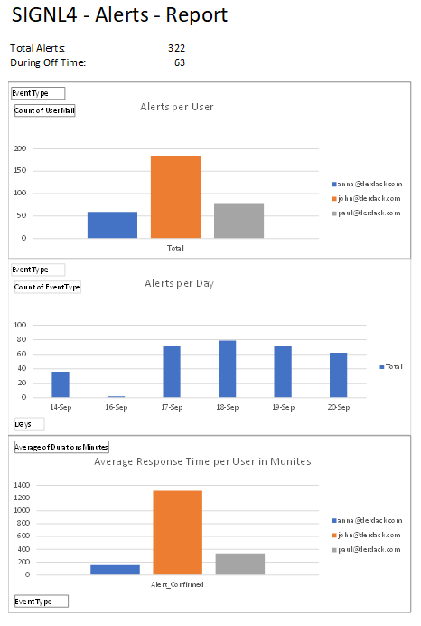
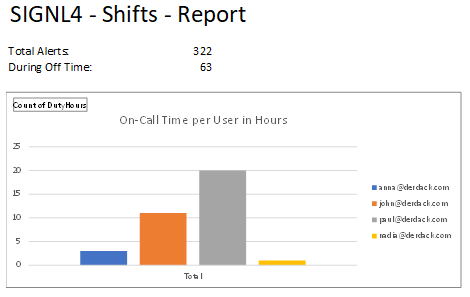
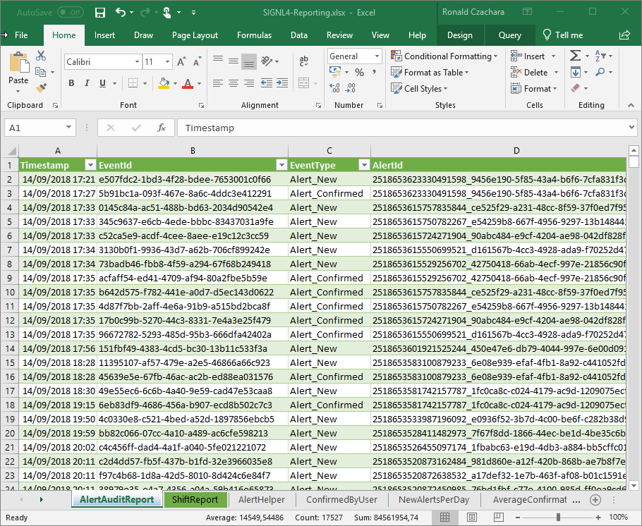

# Alert and Shift Reports for SIGNL4

SIGNL4 provides you with reporting data for on-call times as well as for alerts. This is useful for example to see the workload of your team members, the frequency of certain alert types, compensating your on-call staff, etc. You can access reporting data in your SIGNL4 portal at Audit Train. From here you can download shift / on-call as well as alert data as .csv files.

Here you can see some sample data:

AlertAuditReport.csv
```
Timestamp,EventId,EventType,AlertId,UserId,UserMail,Content,Price,Duration
2018-09-14T15:21:06.9508401Z,e507fdc2-1bd3-4f28-bdee-7653001c0f66,Alert_New,2518653623330491598_9456e190-5f85-43a4-b6f6-7cfa831f3d4e,,,,0.00,
2018-09-14T15:27:17.5749352Z,5b91bc1a-093f-467e-8a6c-4ddc3e412291,Alert_Confirmed,2518653623330491598_9456e190-5f85-43a4-b6f6-7cfa831f3d4e,1082a885-7541-4615-b3ae-6ef7660b834e,anna@derdack.com,,0.00,0
2018-09-14T15:33:44.2164155Z,0145c84a-ac51-488b-bd63-2034d90542e4,Alert_New,2518653615757835844_ce525f29-a231-48cc-8f59-37f0ed7f95f2,,,,0.00,
```
ShiftReport.csv
```
Name;Email;Start;End;Hours
Anna;anna@derdack.com;2018-09-14T15:21:02.0743200Z;2018-09-14T17:31:44.4990010Z;2:10
John;john@derdack.com;2018-09-19T07:51:45.4039920Z;2018-09-19T07:52:29.5466015Z;0:0
John;john@derdack.com;2018-09-19T07:52:58.9672917Z;2018-09-19T08:51:01.8244028Z;0:58
```
You can now process these files from within your reporting tools, for example for accounting. The following example shows how you can generate some nice reports in Microsoft Excel. Here are some examples:

AlertAuditReport



ShiftReport



The general idea here is the following:

1. Download your .csv reporting files from your SIGNL4 portal at Audit Trail.
2. Import the .csv files from Excel. Please make sure to import the data and not just open (double-click) it. The import function can automatically recognize the date / time formats.
3. Do the calculations and create the diagrams you need in Excel.
4. Print or export the reports and send them to whoever needs them.

Getting the above diagrams from the raw files might be quite some effort. We provide an Excel file with all the functions and diagrams as shown above. You can take the file SIGNL4-Reporting.xls and adapt it to your needs.

This Excel file provides the following reporting information:

Alerts
- Total number of alerts
- Alerts outside working hours
- Number of alerts per user
- Number of alerts per day
- Average response times per user

Shifts
- Total number of alerts
- Alerts outside working hours
- On-call time per user in hours

With this Excel file you can add your CSV date in the following way:
1. Open the file SIGNL4-Reporting.xls and point to your .csv files. In order to do so go to Data -> Queries & Connections and then double-click AlertAuditReport on the right-hand side. The Power Query Editor opens. Here go to Home -> Advanced Editor. In the text box you can see the path to the .csv file. Adapt this one to match the path to your AlertAuditReport .csv file. Then click Done and Save & Load to close the Power Query Editor. Do the same for SiftReport as well.
2. Back in the main Excel window click Data -> Refresh All. This will update the report accordingly.
3. You might want to adapt the reports with the information you need. If you have large data sets you can also add additional rows by copy and paste in the Sheets AlertHelper and ShiftHelper.
4. That is it and your reports are available in the Sheets Alerts and Shifts. You can print them or export them as PDF.


(Click to open animated GIF.)

A similar approach is possible with Google Sheets as well.
